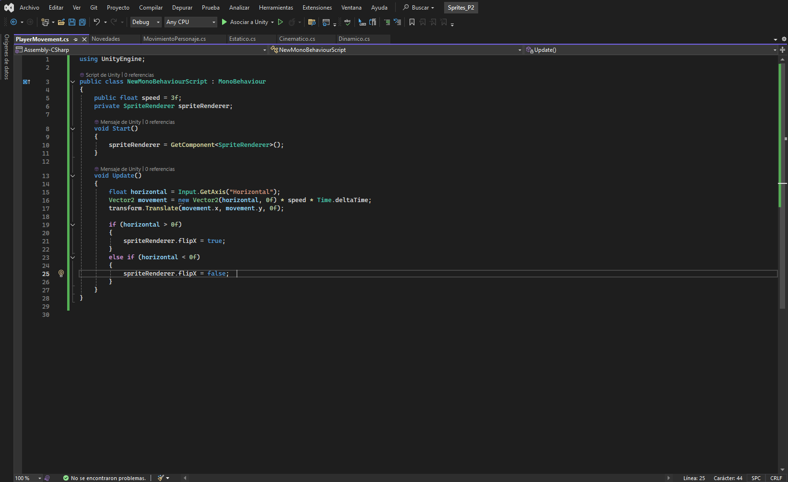

# Fisicas2D_UNITY

Primer Ejercicio. Parte 1

En esta parte hay que provocar varias situaciones para que  nos indique las diferentes situaciones la consola. Para ello hacen falta scripts para os diversos objetos: Dinámico, Estático y Cinemático, además de programarle a cada uno eventos OnCollision2D y OnTrigger2D.

A)Ninguno de los objetos son físicos. 

En este caso no se detecta ni colisión ni trigger por lo que no salta mensaje de la consola. Unity requiere que al menos de los objetos de la consola tenga un rigidbody2D. 

 

B)Un objeto tiene físicas  y el otro no

El sprite de movimiento tiene un rigidbody2d mientras que el  sprite estático solo tiene el Collider2D. Como se detecta colisión, salta el mensaje. Como se ve, el objeto estático se queda quieto por mucho que el otro empuje. 

 

C)Ambos tienen físicas.

Se detecta colisión, sin embargo, el objeto que está quieto se sigue moviendo por la inercia del empuje.

 

D)Ambos objetos tienen físicas y uno de ellos tiene 10 veces más masa que el otro. 

Se detecta la colisión, sin embargo, el segundo objeto al tener más masa, la inercia es más lenta ya que el segundo objeto pesa más. 

 

E)Un objeto tiene físicas y el otro es IsTrigger. 

El sprite animado tiene el rigidbody2d, mientras que al sprite estático le ponemos un Collider2d. Este no entra en colisión, pero si entra en Trigger.

F)Ambos objetos tienen fisicas y uno es trigger.

Ambos tienen rigidbody2d activado pero uno de ellos es Trigger. Entonces no se produce colisión sino que pasara de largo activan el On Trigger. 

G)Uno es cinemático.

Se produce la colisión, sin embargo, el sprite con el rigidbody cinemático se queda quieto por mucho que el dinámico le empuje. 

PARTE 2
A)Objeto estático que ejerce de barrera infranqueable.

Añado un square a la escena que transformo en una pieza más alta y le añado un Box Collider 2D. Probé sin añadirle ningún componente más y el resultado es que la barrera se queda estática y no se puede pasar. 

B)Zona en la que los objetos que caen en ella son impulsados hacia delante.

Para ello transformo el cubo para que sea un área más amplia. Como no quiero colisión, sino que se active al entrar en el área le verifico que sea trigger. Como no pasaba nada, le metí un area effector para probar. Sin embargo, al dejarle el global angle 0, el sprite en vez de salir para adelante, salía para la derecha, y necesitaba que saliera para la izquierda, así que cambié el valor de 0 a 180. 

C)Objeto que es arrastrado por otro a una distancia fija.

Los dos objetos tienen que tener rigidbody2d. Al objeto que va a seguir al primero se le añade un DistanceJoint2D que hará que siga al primer objeto. Hay que tener cuidado con la distancia ya que este puede provocar que no lo siga correctamente. 

	
D)Objeto que al colisionar con otros sigue un comportamiento totalmente físico. 

Añadir Box Collider al objeto y rigidbody2d

E)Incluye dos capas que asignes a diferentes tipos de objetos y que permita evitar colisiones entre ellos. 

Pues en User Layer se crean dos capas diferentes y luego a cada objeto se le asigna una capa. En este caso quiero que colisione con otro sprite en vez del cubo. Luego, en fisicas 2d, se desmarca que la capa 1 y 2 no se produzcan colisiones. 

TILEMAPS

Actividad 1.

Creo un TileMap rectangular donde se creará un Grid y un Tilemap que es donde voy a pintar. Cogí las imágenes de Recursos, le ajusto las dimensiones a 64x64. Se crea  la paleta seleccionando el tileset. Se separa por capas para que no me pinte el sprite y pintamos. 

Actividad 2

He creado dos tilemaps nuevos dentro del Grid que actúan como la decoración y los obstáculos, se repite el mismo proceso de antes con la excepción de que al Tilemap obstáculo le colocamos un tilemap collider2d. Además se han ordenado las capas mediante el Order in layer y un Composite Collider.

Actividad 3

Seguir el pseudocódigo para producir el movimiento. El comentario más relevante de la primera parte es que un transform.translate necesita 3d mientras que el vector al ser un juego en 2d pues puse Vector2.

La rotación se realiza alrededor del eje Z usando el valor del eje horizontal (izquierda/derecha) multiplicado por una velocidad de rotación y el tiempo entre frames. Luego, el personaje se mueve hacia adelante o atrás usando el eje vertical (arriba/abajo).

